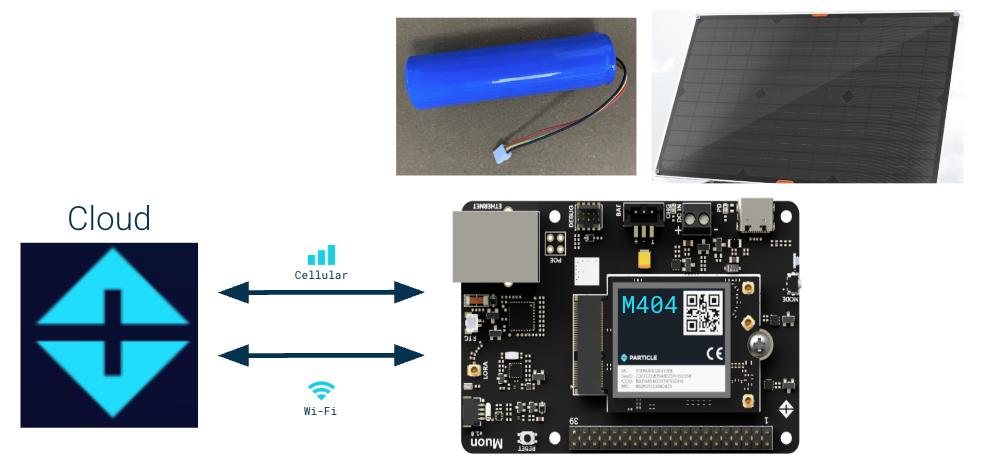
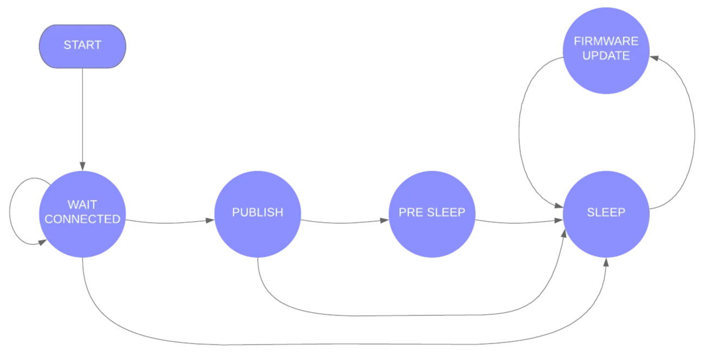

# Solar-Powered Muon + M404 Example

This example demonstrates a real-world, power-optimized setup using the Muon Kit with an M404 SoM. The goal is to build a resilient, solar-powered device using standard components and minimal customization that can last at least one week on battery power alone.



## Hardware

- [Muon Kit with M404 SoM (Cellular + Wi-Fi)](https://store.particle.io/products/test-noram-muoncbkit-bundle?_pos=4&_sid=216aeefe4&_ss=r)
- 3250 mAh single-cell LiPo battery (included in kit)
- [30 W solar panel](https://www.amazon.com/gp/product/B08N4SBDB3?smid=A2C2M9GYREENZU&th=1), connected to `VIN`

## Firmware Overview

This project builds on Particle’s [Wake-Publish-Sleep Example](https://docs.particle.io/firmware/low-power/wake-publish-sleep-cellular/) and implements a finite state machine to handle publishing, OTA updates, and sleep transitions reliably.



## Key Features

### PMIC Configuration

- Disables 3V3_AUX and sets charge current based on power source
- Stores configuration flag in Flash (using EEPROM emulation) to avoid repeated writes

> Note: Starting in Device OS 6.3.1, the 3V3_AUX will be automatically disabled when implementing sleep modes. However, if you are using a prior OS version or want to manage it manually refer to the [Muon firmware settings](https://docs.particle.io/reference/datasheets/m-series/muon-datasheet/#firmware-settings). 
> 

```cpp
// power module hasn't been configured already
// configuration writes value in flash so don't want to overly configure, just once
EEPROM.get(EEPROM_ADDR, powerModuleConfig);
if (powerModuleConfig != PM_FLAG)
{
  Log.info("Configuring Power Module");
  // set power module configuration
  SystemPowerConfiguration conf;
    conf.powerSourceMaxCurrent(1500)    // sets max current from power source (set to max)
      .powerSourceMinVoltage(3880)      // sets min batt voltage
      .batteryChargeCurrent(900)        // sets batt charge current, size based off of solar panel
      .batteryChargeVoltage(4112)       // sets batt charge voltage
      .feature(SystemPowerFeature::PMIC_DETECTION)    // enables PMIC Detection
      .auxiliaryPowerControlPin(PIN_INVALID).interruptPin(PMIC_INTERRUPT_PIN);    // disables 3V3_AUX
  int res = System.setPowerConfiguration(conf); 
  Log.info("setPowerConfiguration=%d", res);
  // returns SYSTEM_ERROR_NONE (0) in case of success

  // write flag value to EEPROM
  EEPROM.put(EEPROM_ADDR, PM_FLAG);
  Log.info("Setting PM_FLAG");
}
```

### Battery-aware Behavior

- Checks SoC and state before connecting to the cloud

```cpp
// check battery level and state
  delay(5s);                                    // delay before reading from the PMIC, gives the PMIC time to settle before reading
  float batterySoc = System.batteryCharge();    // read the battery SoC from PMIC
  int batteryState = System.batteryState();     // read the battery state from PMIC
  Log.info("Battery state: %s", batteryStates[std::max(0, batteryState)]);
  Log.info("Battery charge: %f", batterySoc);

  if ((batterySoc >= LOW_BATTERY_THRESHOLD) || ((batteryState == 2))) {
    // It's only necessary to connect to the cloud. Stepping up one layer
    // at a time with Cellular.connect() and wait for Cellular.ready() can
    // be done but there's little advantage to doing so.
    Particle.connect();

    // if device doesn't connect due to connection timeout, go back to sleep
    waitFor(Particle.connected, 60000);  
    if (!Particle.connected()) {
      Log.info("Fail to connect, connection timeout");      

      // Prepare for sleep
      SystemSleepConfiguration config;
      config.mode(SystemSleepMode::ULTRA_LOW_POWER)   // set sleep to ULP
        .gpio(PMIC_INTERRUPT_PIN, FALLING)            // wake of PMIC _INT (toggle low when changed noted)
        .duration(sleepTime);                         // wake on defined interval
      System.sleep(config);

      // to mimic hibernation mode, reset device (re-run setup())
      System.reset();   // reset the system, ULP continues execution where it left off
    }

    // set the stateTime variable to the current millis() time
    stateTime = millis(); 

  }

  // go back to sleep
  else  {
    Log.info("Fail to connect due to Battery charge: %f", batterySoc);      

    // Prepare for sleep
    SystemSleepConfiguration config;
    config.mode(SystemSleepMode::ULTRA_LOW_POWER)   // set sleep to ULP
      .gpio(PMIC_INTERRUPT_PIN, FALLING)            // wake of PMIC _INT (toggle low when changed noted)
      .duration(sleepTime);                         // wake on defined interval
    System.sleep(config);

    // to mimic hibernation mode, reset device (re-run setup())
    System.reset();   // reset the system, ULP continues execution where it left off
  }
```

### ULP Mode Sleep Logic

- Wakes hourly or when VIN (power) is detected via PMIC Interrupt, PMIC_INT (A7)

```cpp
case STATE_SLEEP:
  // check to determine if a firmware update has been detected
  if (firmwareUpdateInProgress) {
    Log.info("firmware update detected");
    state = STATE_FIRMWARE_UPDATE;
    stateTime = millis();
    // break from switch statement
    break;
  }
  // go to sleep
  Log.info("going to sleep for %ld seconds", (long) sleepTime.count());
  {
              
     // gracefully disconnect from network, required when using SEMI_AUTOMATIC mode
     Network.disconnect();         
     Network.off();        
    
     // Prepare for sleep
     SystemSleepConfiguration config;
     config.mode(SystemSleepMode::ULTRA_LOW_POWER)   // set sleep to ULP
       .gpio(PMIC_INTERRUPT_PIN, FALLING)            // wake of PMIC _INT (toggle low when changed noted)
       .duration(sleepTime);                         // wake on defined interval
     System.sleep(config);

     // to mimic hibernation mode, reset device (re-run setup())
     System.reset();   // reset the system, ULP continues execution where it left off

   }
   // This is never reached; when the device wakes from sleep it will start over with setup() due to System.reset()
   break; 
```

### Adaptive State Logic

- While VIN is present and SoC > 15%, publishes every 15 minutes, otherwise, go to sleep

```cpp
case STATE_PUBLISH:
  // read the battery state and SoC from PMIC
  batteryState = System.batteryState();     
  batterySoc = System.batteryCharge();
  Log.info("Battery state: %s", batteryStates[std::max(0, batteryState)]);
  Log.info("Battery charge: %f", batterySoc);
  //continue to publish value while charging or charged @ PUBLISH_PERIOD interval
  if ((batterySoc >= LOW_BATTERY_THRESHOLD) && ((batteryState == 2) || (batteryState == 3))) {
    if ((lastPublish == 0) || (millis() - lastPublish >= PUBLISH_PERIOD.count())) {
      lastPublish = millis();
      state = STATE_WAIT_CONNECTED;    // go back to STATE_WAIT_CONNECTED
      publish_status();
    }
  }
  // go to sleep after publish
  else  {
    // read the latest battery SoC from PMIC
    batterySoc = System.batteryCharge();
    Log.info("Battery charge: %f", batterySoc);
    // check to confirm batt level is above
    if (batterySoc >= LOW_BATTERY_THRESHOLD) {
      publish_status();
    }
    else {
      Log.info("Fail to publish due to Battery charge: %f", batterySoc);
    }
    // check to put device into  STATE_PRE_SLEEP
    if (millis() - stateTime < cloudMinTime.count()) {
      Log.info("waiting %lu ms before sleeping", (unsigned long)(cloudMinTime.count() - (millis() - stateTime)));
      state = STATE_PRE_SLEEP;
    }
    // cloudMinTime has elapsed, go into STATE_SLEEP
    else {
      state = STATE_SLEEP;
    }
  }
  // break from switch statement
  break;
```

### Typed + Extended Publish

- Uses new [Typed and Extended publish()](https://docs.particle.io/reference/device-os/api/cloudevent/getting-and-settings-cloudevent/#cloudevent) API introduced in OS 6.3.0 for reliable message delivery with timeouts.
- The event or publish name is dictated whether the device will remain in an active state, “Powered”, or whether the device will go to sleep, “Sleep”. 

```cpp
// function for publishing the status of the device
void publish_status() {

  // local variables
  int powerSource = System.powerSource();
  int batteryState = System.batteryState();
  float batterySoc = System.batteryCharge();                     

  // set objects within json
  particle::Variant obj;
  obj.set("Battery charge %:", batterySoc);
  obj.set("Battery state:", batteryStates[std::max(0, batteryState)]);
  obj.set("Power source:", powerSources[std::max(0, powerSource)]);
  
  // set event name, data, and publish()
  if (state == STATE_WAIT_CONNECTED){
    event.name("Powered");
  }
  else  {
    event.name("Sleep");
  }
  event.data(obj);
  Particle.publish(event);
  Log.info("publishing %s", obj.toJSON().c_str());

  // Wait while sending
  waitForNot(event.isSending, 60000);

  // logic for determining success/failure of publish()
  if (event.isSent()) {
    Log.info("publish succeeded");
    event.clear();
  }
  else 
  if (!event.isOk()) {
    Log.info("publish failed error=%d", event.error());
    event.clear();
  }
}
```